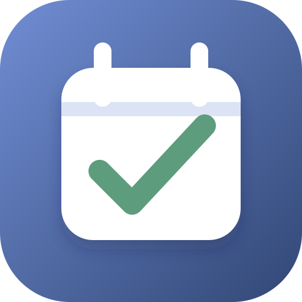

# Teaching Time Tracker

<p align="center">
  
</p>

<p align="center">
  A private, local-first desktop workspace for tracking student-teaching hours, clinical days, professional development, and semester progress.
</p>

<p align="center">
  <a href="https://github.com/Whiteoak789/teaching-time-tracker/releases/latest"></a>
  
  
  
</p>

Teaching Time Tracker gives student teachers one place to record teaching activity, understand day-credit requirements, prepare timesheets and reports, and keep restorable backups. It works without an account or internet connection and stores the working database on the computer.

## Download

[**Download for macOS (Universal DMG)**](https://github.com/Whiteoak789/teaching-time-tracker/releases/download/v1.0.3/Teaching-Time-Tracker_1.0.3_macOS_universal.dmg) · [**Download for Windows (Setup EXE)**](https://github.com/Whiteoak789/teaching-time-tracker/releases/download/v1.0.3/Teaching-Time-Tracker_1.0.3_Windows_x64-setup.exe) · [Latest release and notes](https://github.com/Whiteoak789/teaching-time-tracker/releases/latest)

| Platform | Build | Installation |
| --- | --- | --- |
| macOS | Universal build for Apple Silicon and Intel | Open the `.dmg`, then drag **Teaching Time Tracker** into **Applications**. |
| Windows | 64-bit setup installer | Open the setup `.exe` and follow the prompts. Windows adds normal app and uninstall entries. |

### First-launch security prompts

The current public installers are ad-hoc signed on macOS and unsigned on Windows. The operating system may therefore ask you to confirm the first launch.

On macOS:

1. Try to open Teaching Time Tracker once.
2. Open **System Settings → Privacy & Security**.
3. Find the message about Teaching Time Tracker and select **Open Anyway**.
4. Confirm **Open** when macOS asks again.

You can also Control-click the app in **Applications**, select **Open**, and confirm the prompt. You normally need to do this only once for that copy of the app.

On Windows, select **More info → Run anyway** if Microsoft Defender SmartScreen appears. These prompts can be removed from future releases after Apple Developer ID signing/notarization and Windows code-signing certificates are configured.

## What it does

The app is organized around a calendar and a semester. A time entry records when and where work happened, what category it belongs to, whether it counts toward clinical or professional-development totals, and any supporting notes. Semester rules then convert eligible hours into half-day or full-day credit and feed the timesheet, goals, summaries, and reports.

| Area | Capabilities |
| --- | --- |
| Calendar | Month, week, and list views; drag entries to reschedule; add, edit, duplicate, and delete records. |
| Time tracking | All-day or timed entries, calculated or manual duration, day-credit override, location, supervisor, description, and private notes. |
| Semester rules | Multiple semesters, date ranges, hour requirements, half/full-day thresholds, clinical-day rules, and category behavior. |
| Timesheets | Weekly review, status tracking, and verification details. |
| Progress | Summary charts, requirement totals, goals, projections, category breakdowns, and clinical-day progress. |
| Organization | Search, notes, pinned calendar notes, custom categories, reminders, themes, and keyboard shortcuts. |
| Reports | Semester, weekly, monthly, PD, clinical-day, absence, closure, verification, category, and detailed time-log reports. |
| Data portability | CSV, JSON, printable, and PDF output, plus portable backup archives. |
| Backups | Verified SQLite snapshots, optional encrypted archives, restore checks, safety backups, scheduling, history, and retention. |

## Getting started

### 1. Complete the initial setup

On first launch, enter your profile and create a semester. Set the semester dates, required hours or days, and the hour thresholds that determine half-day and full-day credit. These rules can be adjusted later in Settings.

### 2. Record teaching time

Select **Add time** from the calendar or press <kbd>⌘/Ctrl</kbd> + <kbd>N</kbd>. Choose a date and category, then enter either start/end times or a duration. You can also record the school, teacher or supervisor, description, notes, attachments or references, and whether the entry counts toward clinical days or PD.

The form calculates duration automatically when possible. Manual duration and day-credit overrides remain available for records that do not fit the normal semester rules.

### 3. Review progress

Use **Timesheet** for week-by-week review and verification. Use **Summary** and **Goals** to compare completed work with semester requirements and see projected progress. Entries can be corrected at any time; dependent totals update from the saved data.

### 4. Create reports

Open **Reports**, select the report type and date or semester filters, and then export the result. CSV and JSON are useful for portable data, while printable and PDF output are intended for submission or recordkeeping.

### 5. Configure a backup

Open **Backup**, choose a destination folder, create a test backup, and confirm that it appears in backup history. See [Backups and cloud storage](#backups-and-cloud-storage) before enabling automatic backups.

## Backups and cloud storage

Backups are portable `.teachingtracker` archives created from a consistent SQLite snapshot. The app records checksums, validates a selected archive before restoring it, and creates a safety backup of the current database before replacement.

Available backup destinations include:

- A folder on the computer
- An external drive
- A mounted network folder
- A folder managed by a desktop cloud-sync client
- iCloud Drive on macOS through a selected filesystem folder

For Google Drive, install **Google Drive for desktop**, let it create or mount a local Drive folder, and select a folder inside it as the custom backup destination. The same approach works with locally mounted OneDrive and Dropbox folders.

The Google Drive, OneDrive, and Dropbox provider cards are not directly connectable in the public build because direct OAuth support requires application-owned provider client IDs. Selecting a cloud-mounted folder is the supported cloud-backup route today.

> [!IMPORTANT]
> Select a cloud-synced folder for backup archives; do not move or directly sync the app's live SQLite database. Automatic startup, scheduled, and app-close backups do not store an encryption password and are currently created without password encryption. Password-based Argon2id + AES-256-GCM encryption applies to manual backups when you enter a password.

Keep the password for an encrypted backup somewhere safe. It is not stored by the app and cannot be recovered.

## Keyboard shortcuts

| Action | Shortcut |
| --- | --- |
| New time entry | <kbd>⌘/Ctrl</kbd> + <kbd>N</kbd> |
| Search | <kbd>⌘/Ctrl</kbd> + <kbd>K</kbd> |
| Settings | <kbd>⌘/Ctrl</kbd> + <kbd>,</kbd> |
| Open Backup | <kbd>⌘/Ctrl</kbd> + <kbd>B</kbd> |
| Close the active dialog | <kbd>Esc</kbd> |
| Show shortcut help | <kbd>?</kbd> |

## Privacy and security

- No account is required.
- There is no analytics SDK or application server.
- The working SQLite database stays in the operating system's application-data directory.
- Data leaves the device only through an export or backup action you configure.
- Database access uses parameterized queries and schema migrations run transactionally.
- Desktop capabilities are scoped through Tauri permissions and a content security policy.
- Backup restore checks archive structure, database identity, integrity, and checksums before replacing live data.

Exports and unencrypted backups contain user-entered information. Treat them like any other private teaching or school record and store them in an appropriately protected location.

## Current limitations

- Public macOS builds are not yet Developer ID signed or Apple-notarized.
- Public Windows builds are not yet code-signed.
- Direct OAuth connection for Google Drive, OneDrive, and Dropbox is configuration-gated; mounted folders work instead.
- Automatic backups are unencrypted because backup passwords are intentionally never stored.
- Release installers are currently provided for macOS and 64-bit Windows, not Linux.

## Development

### Prerequisites

- Node.js 20 or newer
- npm
- Current stable Rust toolchain
- The platform dependencies listed in the [Tauri 2 prerequisites](https://v2.tauri.app/start/prerequisites/)

Clone and start the desktop development build:

```bash
git clone https://github.com/Whiteoak789/teaching-time-tracker.git
cd teaching-time-tracker
npm install
npm run tauri:dev
```

The Vite browser preview is useful for fast UI work, but native filesystem dialogs, notifications, SQLite persistence, and other Tauri behavior require the desktop development build:

```bash
npm run dev
```

### Checks and builds

| Command | Purpose |
| --- | --- |
| `npm test` | Run the frontend calculation tests once. |
| `npm run test:watch` | Run frontend tests in watch mode. |
| `npm run build` | Type-check and create the production web assets. |
| `cargo check --manifest-path src-tauri/Cargo.toml` | Check the Rust backend. |
| `npm run tauri:build` | Create a production desktop bundle for the current platform. |

Run the main checks before submitting a code change:

```bash
npm test
npm run build
cargo check --manifest-path src-tauri/Cargo.toml
```

## Architecture

Teaching Time Tracker uses a local-first desktop architecture:

```text
React + TypeScript pages and components
                │
        Zustand application state
                │
          Typed Tauri IPC adapter
                │
     Rust commands and domain validation
                │
             SQLite database
```

The browser adapter supports frontend preview and test workflows. The production desktop app sends typed requests through Tauri commands to the Rust backend, where input is validated and persisted in SQLite. Credit calculations are shared as explicit domain logic and covered by frontend tests.

Read the deeper implementation guides:

- [Architecture and data flow](ARCHITECTURE.md)
- [Tauri command API](API.md)
- [Database migration policy](MIGRATIONS.md)
- [Release notes](RELEASE_NOTES.md)

## Project structure

```text
src/
├── api/                 Typed Tauri IPC and browser preview adapter
├── components/          App shell, onboarding, forms, dialogs, and UI primitives
├── lib/                 Tested credit and progress calculations
├── pages/               Calendar and supporting product screens
├── stores/              Zustand application state
└── types/               Shared frontend domain contracts
src-tauri/
├── capabilities/        Least-privilege desktop permissions
└── src/
    ├── api/             Commands and backup/restore implementation
    ├── db/              Pool, normalized migrations, and Rust models
    ├── error.rs         Serializable application errors
    └── lib.rs           Tauri lifecycle and command registration
```

## Publishing a release

The GitHub Actions **Release installers** workflow builds on GitHub-hosted macOS and Windows machines. It can be started manually or by pushing a version tag such as `v1.0.3`. The workflow prepares a draft, waits for both platform builds to succeed, assigns stable asset names, and then publishes the release.

Version values in `package.json`, `src-tauri/Cargo.toml`, and `src-tauri/tauri.conf.json` should agree before creating the tag.

## Contributing

Bug reports and focused pull requests are welcome. When reporting a problem, include the operating system, app version, steps to reproduce it, and a screenshot when the issue is visual. Please remove names, schools, notes, and other private information before attaching screenshots, exported data, databases, or backup archives.

For code changes, keep database migrations append-only, preserve the local-first privacy model, and run the checks listed above before opening a pull request.
